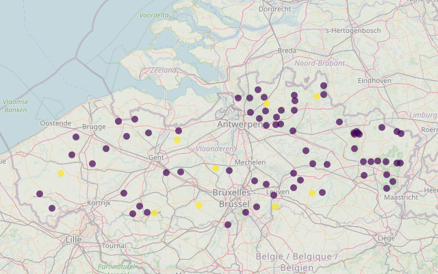

<!-- bookdown::render_book('Revisie Bosvitaliteit') -->
<!-- bookdown::render_book(output_format = "INBOmd::pdf_report") -->

# Inleiding

## Opdracht

Het managementteam van het INBO wil de meetnetten die het INBO beheert laten reviseren om te onderzoeken of er winsten kunnen gehaald worden in efficiëntie en effectiviteit.
Dit meetnet is een van de eerste meetnetten die gereviseerd worden.

De doelstelling zijn (1) het bekomen van een goed gedocumenteerd meetnet, waarbij de keuzes over wat, hoe, waarom en hoeveel er gemeten wordt, duidelijk zijn, (2) kijken waar er winsten kunnen gehaald worden in efficiëntie en effectiviteit, en (3) deze eerste evaluatie- en bijsturing van het meetnet inbedden in een adaptieve cyclus met periodieke meetnetrevisies die aangestuurd worden door de meetnetbeheerder.

## Historiek meetnet

Halverwege de jaren 80 van vorige eeuw is in opdracht van de  Europese comissie een expertenpanel opgericht om de gezondheidstoestand van de Europese bossen op te volgen.
Dit panel werd gedoopt als *ICP Forests* waarin de Europese landen vertegenwoordigd zijn.

Vanuit ICP Forests werd een Europees meetnet ontworpen die deze gezondheidstoestand opvolgt doormiddel van kroonbeoordelingen waar het blad- en naaldverlies  van (co)-dominante bomen in klassen van 5% visueel wordt beoordeeld. 
Bomen worden als beschadigd aanzien vanaf een bladverlies groter dan 25%.

Het bosvitaliteitsmeetnet - ook gekend als het Level-1 meetnet - is hiervan het resultaat. 
Het is intussen een heel langlopend meetnet, vermoedelijk een van de oudste meetnetten op het INBO, waarbij de eerste gegevens reeds van 1987 dateren.

Het huidige meetnet bevat 78 proefvlakpunten (zie figuur \@ref(fig:plotloc) ) waar dezelfde  20-25 bomen jaarlijks bemonsterd worden.
Oorspronkelijk was het meetnet veel kleiner, en werden enkel punten gelegen in bossen in een 16 x 16 km grid over Europa meegenomen. In Vlaanderen werd dat al snel uitgebreid tot 8 x 8 km en vanaf 1995 zelfs nog denser in punten op een grid van 4 x 4 km.



```{r plotloc, echo=FALSE, out.width="5%", out.height="5%", fig.cap="Ligging van de punten in VLaanderen (paars vanaf 1987 (34), blauw vanaf 1988-1992 (5), groen vanaf 1995 (30) en geel later dan 2018 (9)). Enkele proefvlakken zijn intussen verdwenen."}
knitr::include_graphics("data/pixel.png")
```

<!--
```{r plotlocold, eval = FALSE, include = FALSE, echo = FALSE, message = FALSE, fig.cap="Ligging van de meetpunten en de periode wanneer deze eerst opgemeten zijn"}

df_trend <- readRDS('data/dfTrees_trend.RDS')
startyears <- df_trend %>% 
  group_by(PlotNr) %>% 
  summarise(start = min(Jaar))

proefvlakken <- readr::read_csv2("data/coords_proefvlakken.csv") %>% 
  left_join(startyears, by = c('PROEFVLAK'= 'PlotNr') ) %>% 
  mutate(startperiode = ifelse(start == 1987, 
                              '1987 (34)',
                              ifelse(start < 1995,
                                     '1988-1992 (5)',
                                    ifelse (start < 2018, 
                                          '1995 (30)', 
                                          '2019-2022 (9)'))))
proefvlakken <- sf::st_as_sf(proefvlakken, 
                             coords=c("LONGITUDE (X)","LATITUDE (Y)"), 
                             crs=31370)

vlaanderen <- sf::read_sf("data/vlaanderen.shp")

ggplot() +
  geom_sf(data = vlaanderen) +
  geom_sf(data = proefvlakken, aes(color = startperiode, fill = startperiode), 
          shape = 25, size = rel(1.0)) + 
  theme(legend.position = "bottom")

```
--> 

