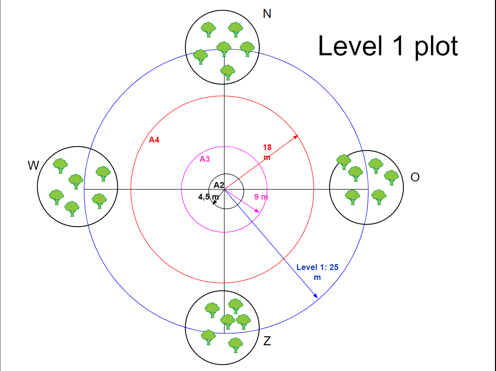
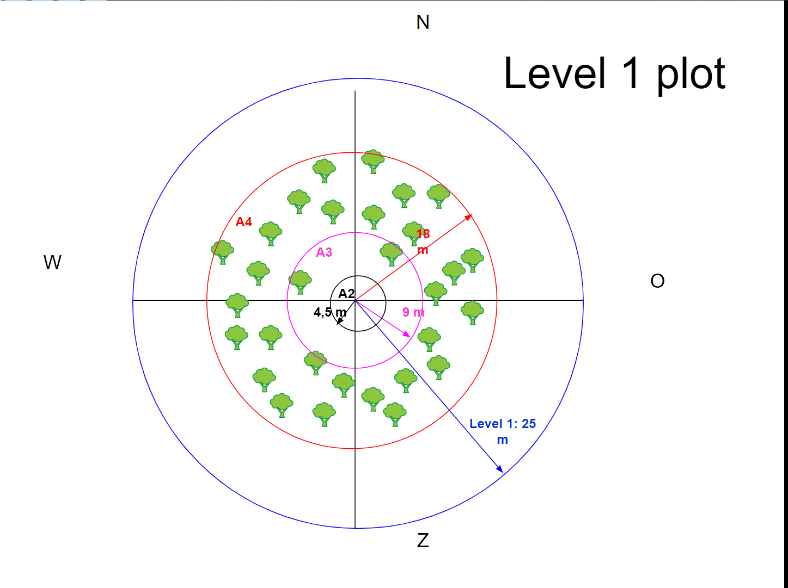

# Beoordeling aan de hand van de fasen van het meetnetontwerp

Het team BMK op het INBO heeft in 2008 een leidraad voor meetnetontwerp ontwikkeld [ @onkelinx2008ontwerp].
Hier wordt het meetnetontwerp in verschillende fasen opgedeeld en geïllustreerd wat de belangrijkste vragen zijn die in iedere fase opgelost moeten worden.
Op basis van deze leidraad wordt het meetnet in dit hoofdstuk bekeken.

## Fase I: Prioritering van de informatiebehoeften

Het meetnet is gedragen door een overkoepelende organisatie (ICP-Forests) die de kapstok vormt voor het meetnet.
De monitoring wordt begeleid door verschillende expertengroepen van het internationale netwerk rond bossen.

### Welke vraag moet beantwoord worden?

#### ICP Forests verplichting

Alle gridpunten die in bos vallen in een 16x16km Europees grid moeten jaarlijks gerapporteerd worden in termen van  blad- of naadverlies (Level-I meetnet) en in detail voor andere kenmerken zoals bv. stikstof- en koolstofdepositie (Level-II meetnet).

Hiervoor moet de door ICP forest opgelegde methodologie gebruikt worden waarbij gebruik gemaakt wordt van visuele kroonbeoordelingen.

#### Interne vraag

De hoofdvraag voor het meetnet is: hoe evolueert de gezondheidstoestand van de bomen in de Vlaamse bossen?

Er zijn hier geen normen of concreet meetbare doelstellingen aan verbonden. Dit is een hiaat die moet worden aangepakt, omdat juist deze doelstellingen heel belangrijk zijn om het meetnet te kunnen dimensioneren. Ook een ruimere kadering zou nuttig zijn: wat is het belang voor de maatschappij, voor de natuur in kader van klimaatverandering.

Een mogelijke vraag, in lijn met andere meetnetten op het INBO, zou hier kunnen zijn dat een verslechtering van de toestand van 12% gedecteerd kan worden na een periode van 12 jaar, of 20% op 20 jaar.
Daarnaast is het ook interessant om te zien welk verschil gedetecteerd kan worden tussen 2 opeenvolgende jaren, want hoe krachtiger dit is, hoe krachtiger ook het meetnet zal zijn op langere termijn.

Een andere belangrijk aspect is om een onderscheid te maken of we een uitspraak willen doen over de volledige bosgemeenschap in Vlaanderen of dat dit per soort of regio apart moet kunnen.
Om hiervoor uitspraken te onderbouwen, zal een aangepast aantal steekproefpunten nodig zijn. Enkel Grove den en zomereik komen in de steekproef veel voor (>= 20 plots).

### Aanbod

Een groot verschil met dit meetnet ten opzichte van het merendeel van andere INBO meetnetten is dat hier voor alle proefvlakken een jaarlijkse beoordeling gebeurt.
In veel meetnetten wordt gewerkt met een meetcyclus van meerdere jaren en wordt enkel gemeten in het begin en einde van de cyclus.

Voor alle proefvlakken zijn locatiegegevens beschikbaar, alsook enkele afgeleide variabelen zoals het type eigenaar.
Voor de laatste nieuwe plots zitten de coördinaten eind 2022 nog niet in de bosvitaliteitsdatabank, maar die zullen toegevoegd worden.

Per plot wordt opgemeten : 

- Plotlocatiegegevens
- Plothoogte (GPS en DTM)
- Dichtstbijzijnde meteostation
- Plothistoriek
- Eigenaar + type (openbaar-privé)


De hoofdvariabele die voor iedere boom opgemeten wordt, is het bladverlies bij loofbomen en het naaldverlies bij naaldbomen.
Voor het gemak zullen  beiden gewoon als bladverlies benoemd worden in de rest van de tekst.
Deze metingen worden gedaan door een kroonbeoordeling met de verrekijker waarbij wordt ingeschat hoeveel procent van de kroon ontbreekt.
Hiervoor is een meetprotocol uitgewerkt door ICP forests.
De manual kan gevonden worden op de [handleidingenwebsite van ICP forests](http://icp-forests.net/page/icp-forests-manual).

Dit beoordelen van de kroon is het meest tijdsintensieve van de verschillende metingen per boom, omdat de bomen regelmatig vanuit verschillende hoeken moeten beoordeeld worden.
Aangezien de visuele beoordeling gedaan in klassen van 5%, wat vrij gedetailleerd is, is het belangrijk de bomen grondig te bekijken, zodat de metingen relevant zijn en niet teveel afwijkingen vertonen. 

Het bladverlies geldt als proxy voor de vitaliteit van de bomen.
Er wordt met een grens van 25% gewerkt , waarbij bomen met 25% of minder bladverlies als gezond worden aanzien en bomen met meer als beschadigd.

Andere indicatieve metingen voor de vitaliteit:

- Aantal Naaldjaargangen
- Zaadzetting
- Waterscheuten
- Omtrek ter hoogte van een geverfde lijn (niet jaarlijks)
- Boomsoort
- Leeftijdsklasse op basis van bestandsleeftijd


Zowel het symptoom als de vermoedelijke oorzaak wordt genoteerd alsook waar dat symptoom op de boom terug te vinden is.

Verder gebeurt een nog meer gedetailleerde symptoombeschrijving die in relatie staan tot de gezondheid van de boom. Dit is vooramelijk door een visuele inspectie op kroon, takken en stam.
Verder wordt hierbij ook getracht een oorzaak te bepalen.

De symptomen worden opgemeten in volgende vormen:

- logisch (aan/afwezigheid)
- klassen: 0% 0-10% 11-20% 21-40% 41-60% 61-80% 81-99% 100%

Aangetaste delen en symptomen (in klassen tenzij anders aangegeven):

- blad/naald
    - deels opgegeten (aangevreten, gaatjes, inkerving, ...)
    - verkleuring: groengeel, roodbruin, brons, ander
    - kleinbladerigheid
    - vervorming
    - ander symptoom
    - tekenen aanwezigheid insecten (aan- / afwezig)
    - tekenen aanwezigheid schimmels (aan- / afwezig)
    - tekenen van andere invloeden (aan- / afwezig)

- takken, twijgen, scheuten, knoppen, vruchten
    - aangevreten (ontbrekend)
    - gebroken
    - dood of afstervend
    - afgestoten of afgesneden
    - necrose
    - wonden (ontschorsing, scheuren, andere wonden)
    - harsuitvloei
    - slijmuitvloei
    - ander symptoom
    - vervorming (gedraaid, kanker, ...)
    - tekenen aanwezigheid insecten (aan- / afwezig)
    - tekenen aanwezigheid schimmels (aan- / afwezig)
    - tekenen van andere invloeden (aan- / afwezig)
    

- kroontop, volledige stam, stam onder de kroon, stambasis, wortelaanloop
    - necrose
    - wonden 
    - harsuitvloei
    - slijmuitvloei
    - vervorming
    - gekanteld (scheef), gevallen (met wortels), gebroken (aan- / afwezig)
    - ander symptoom
    - tekenen aanwezigheid insecten (aan- / afwezig)
    - tekenen aanwezigheid schimmels (aan- / afwezig)
    - tekenen van andere invloeden (aan- / afwezig)

Beschreven oorzaken:

- wild- en begrazing
- insecten
- schimmels
- abiotische factoren
- verstoring door de mens
- vuur
- luchtverontreiniging
- andere factoren
- onderzocht maar niet geïdentificeerd


In het begin van het meetnet werd een bodemanalyse uitgevoerd op de toen in het meetnet aanwezige proefvlakken. Mogelijks wordt dit in de toekomst nog eens herhaald. Daarnaast is het gemakkelijk alle klimaatdata te verkrijgen van meteostations in de buurt van de meetpunten. Het dichtsbijzijnde meteostation voor elk proefvlak is bewaard in de databank.

### Verbruiksgoederen

Voor dit meetnet zijn heel weinig verbruiksgoederen, aangezien bijna alles een visuele beoordeling is.
De belangrijkste uitgavenkosten naast het personeel zijn:

- Autokilometers naar de verschillende plots (ca 9000km in 2022)
- Verf: Om bomen te nummeren of te markeren en om een streep te zetten voor de omtrekmeting. Dit is niet ieder jaar nodig, maar soms is een extra laagje verf van nut
- Verrekijkers en rugondersteuning om naar boomtoppen te kijken
- Meetlinten voor de omtrekmetingen
- Kapmes voor toegankelijkheid
- Gepaste kledij


### Eindgebruikers

Er zijn 5 eindgebruikers voor dit meetnet:

- INBO
- Statistiek Vlaanderen
- ICP Forests en hierlangs de Europese commissie
- Pers
- Doctoraats- en thesisstudenten en studiebureau's

#### INBO

Er wordt jaarlijks een gedetailleerd INBO rapport gemaakt die de data bespreekt, zowel over de bevindingen van het laatste jaar, als vergelijkingen tussen de laatste jaren en een trendanalyse.
De laatste jaren zijn ook op een gelijkaardige manier specifiek de essen opgevolgd in een ander INBO project.

#### Statistiek Vlaanderen

Er is een INBO indicator `beschadigde bosbomen` die het resultaat is van deze data, en deze indicator wordt ook overgenomen door statistiek Vlaanderen.

#### ICP forests

Jaarlijks is er ook een rapportage naar ICP forests, welke bestaat uit 2 belangrijke onderdelen.
Het eerste deel is over een klein aantal vooropgestelde proefvlakken, het tweede deel omvat de data van alle proefvlakken en wordt gebruikt voor de statistische analyse van ICP forests.
De resultaten van ICP forests worden  doorgcommuniceerd aan de Europese commissie.


#### Pers

De bespreking van de evolutie van de bosvitaliteit wordt in de INBO nieuwsbrief opgenomen.
Geregeld komt er ook een vraag van de pers rond deze gegevens.

#### Doctoraats- en thesisstudenten en studiebureau's

De gegevens worden voorlopig nog niet gepubliceerd, maar als er een degelijke vraag is om de gegevens te willen gebruiken, wordt dit altijd toegestaan.
Zo kunnen de gegevens gebruikt worden in verschillende onderzoeken in Vlaanderen, voornamelijk voor thesissen en doctoraten, maar ook studiebureau's kunnen de data opvragen.

<!------------------------------------------------------>

## Fase II: Ontwerp gegevensinzameling

### Veiligheid

Er wordt nooit een proefvlak bezocht zonder expliciete toestemming van de eigenaar. Dit houdt in dat privé bossen minder in de steekproef aanwezig zijn.

Het werk is vrij belastend voor de rug, doordat veel met een verrekijker hoog in de bomen moet gekeken worden. Daarom is het aangeraden dat er specifieke ondersteuning voor de rug gebruikt wordt om medische problemen te voorkomen.

### Doelpopulatie

De doelpopulatie zijn de bossen in Vlaanderen, maar door verschillende redenen die later aan bod komen, wijkt de populatie die de steekproef bestrijkt af van de vooropgestelde doelpopulatie. 

#### Representativiteit

De steekproef is niet volledig representatief voor de bossen in Vlaanderen:

De proefvlakken worden verplaatst zodat ze volledig in een bos vallen, waardoor er geen uitspraak gedaan wordt over alles wat bos is in Vlaanderen, omdat bosranden niet in de steekproef voorkomen. 

Daarnaast worden sedert 1995 extra steekproefpunten bemonsterd om bepaalde soorten beter mee te hebben (voornamelijk voor beuk), waardoor de steekproef niet meer volledig representatief is voor Vlaanderen.
Vergelijking met de [bosinventarisatie](https://www.natuurenbos.be/sites/default/files/vlaamse-bosinventaris/WEBSITE_Boomsoortensamenstelling.html) (zie figuur \@ref(fig:soortenvgl)):

```{r soortenvgl, echo = FALSE, fig.cap= "Vergelijking aantal bomen in bosvitaliteitsmeetnet (punten) en de meest recente data uit de Vlaamse bosinventarisatie (balken)"}
soorten_2022 <- 
  read.table(sep = ";", header = TRUE,
             text = 
"Soort;VBI_low;VBI_high;LV1
Grove den;15.5;18.8;470
Berk;12.8;15.7;31
Inlandse eik;9.8;11.8;443
Zwarte Els;7;10.4;18
Corsicaanse den;7;10.1;145
Amerikaanse vogelkers;4.4;6.3;0
Amerikaanse eik;3.8;5.7;93
Wilg;1.6;3.3;0
Gewone esdoorn;2.2;3.6;19
Es;1.7;3.6;34
Beuk;2;3.3;149
Populier;1.8;2.5;16") %>% 
  mutate(LV1 = LV1/14.86)

ggplot(data = soorten_2022 %>% 
         mutate(Soort = reorder(Soort, VBI_high, max, decreasing = TRUE))) + 
  geom_segment(aes(x = Soort, xend = Soort, y = VBI_low, yend = VBI_high),
               alpha = 0.7, color = inbo_lichtgroen, linewidth = 5) +
    geom_point(aes(x = Soort, y = LV1)) + 
  xlab("Soort") + ylab("Stamtal (%)") +
  theme(axis.text.x=element_text(angle=90))
```

In het bosvitaliteitsmeetnet zijn duidelijk heel wat meer grove dennen, inlandse eiken en beuken aanwezig, en is er een duidelijke ondermaat in berken, elsen en Amerikaanse vogelkersen.
Op zich is dit niet onlogisch omdat de manier van bomen selecteren helemaal anders is, waarbij het bosvitaliteitsmeetnet vooral de hogere en dikkere en dus ook oudere bomen zal bevoordelen, en de bosranden niet meegenomen worden.

Verder zijn vooral proefvlakken bemonsterd waar geen speciale toestemmingen voor nodig zijn, en liggen deze veelal in openbaar gebied.

De proefvlakken worden al heel lang opgevolgd, wat een mooie tijdreeks oplevert, maar intussen is de tijdsreeks al zo lang dat ook de leeftijd een rol begint te spelen in de vitaliteit van de proefvlakken, wat eveneens niet meer representatief is voor de volledige bosgemeenschap.

#### Uitspraakeenheid

De steekproefgrootte is oorspronkelijk gekozen om uitspraak te doen in Vlaanderen over alle soorten heen, voor analyse per soort of per regio zal een aangepaste en grotere steekproef nodig zijn om dezelfde evoluties als in Vlaanderen te kunnen vaststellen.

Voor het huidige meetnet is het doenbaar om alle metingen in optimale omstandigheden te uit te voeren, namelijk in de zomer wanneer het kroondak het beste gesloten is en enkel op dagen waar het weer voldoende goed is, zodat alle metingen zonder problemen uitgevoerd kunnen worden.
Hierdoor is de hoeveelheid uitval van metingen door overmacht heel beperkt.


### Meetvariabele

#### Hoofdvariabele

Dit kwam al eerder aan bod bij de beschrijving van het aanbod. De hoofdvariabele bij uitstek is de visuele beoordeling van de kronen in 5% klassen.

#### Extra variabelen

Naast bladverlies worden veel andere zaken gemeten zoals de symptomen van verminderde vitaliteit en oorzaken van deze symptomen.
In kader van het meetnet zelf kan niet veel gedaan worden met deze extra variabelen.
Voor de jaarlijkse rapportage zijn deze wel interessant omdat die symptomen ook kunnen wijzen op bredere problemen, die gelinkt kunnen worden aan veranderingen van het klimaat, of kunnengrote verschillen in bladverlies tussen 2 jaren illustreren. Voor het meetnet zelf waarbij enkel de hoofdvariabele van belang is, zouden deze kunnen weggelaten worden, maar omdat deze in vergelijking met de kroonbeoordeling veel minder tijdsinvestering vereisen, zal dit niet leiden dat er meer proefvlakken per dag bezocht kunnen worden, dus kan het ook geen kwaad om deze te meten.


### Statistisch eenheid

De metingen gebeuren per boom en ook het statistisch model zal op boomniveau worden berekend in eerste instantie, maar omdat er zoveel individele bomen aanwezig zijn in dit meetnet leidt dit tot convergentieproblemen.
Daarom zal vooral gefocust worden op het plotniveau als statistische eenheid.

De bomen kunnen eerder gezien worden als verschillende replicates binnen een plot om een goede inschatting te maken van de kwaliteit van het proefvlak, omdat dit het meest informatieve niveau is.
De meeste variatie wordt immers verwacht tussen de plots.
Als een plot over het algemeen minder of beter presteert heeft dit meer betekenis dat dat 1 boom in een plot beter of minder presteert. Het opmeten van meerdere bomen per plot leidt vooral dat de inschatting van het bladverlies op plotniveau veel nauwkeuriger is. De nauwkeurigheid verbetert a rato van de vierkantswortel van het aantal bomen in een plot.

### Beperkingen rond de metingen

Dit is eerder een opinie dan feit, vooral gevoed door eens mee te gaan op het veld. 
Volgens mij is het heel moeilijk om een correcte objectieve beoordeling van de kroon te krijgen in klassen van 5%, maar ook zal de beoordeling niet meerdere klassen afwijken van de realiteit.
Op zich is dit geen probleem, en is eigen aan ieder meetnet, dit is dus enkel een extra mogelijk meetfout die in het model in rekening gebracht wordt.
Hoe meer bomen per plot beoordeeld worden, hoe zekerder we kunnen zijn over hoe het met het plot gesteld is, zelfs is niet elke beoordeling volledig nauwkeurig (zie figuur \@ref(fig:invloedaantalbomen).
Doordat we uitmiddelen over de bomen in een proefvlak heen, zal de inschatting op proefvlakniveau in de buurt komen van een continue variabele.
Het grootste nadeel is dat een dode boom heel het proefvlak sterk kan duwen in de richting van slechtere vitaliteit, omdat dit een bladverlies van 100% is terwijl de rest meestal beneden de 50% ligt.

```{r invloedaantalbomen, echo = FALSE, warning = FALSE, fig.cap = "Schets van hoe onzeker het gemiddeld bladverlies per proefvlak wanneer het gemiddelde op meer bomen berekend wordt. Dit wordt gedaan voor een meetfout op het bladverlies op de boom van 0.5,0.1 en 0.15, waarbij het bladverlies gecodeerd is van 0 tot 1 (100 procent)."}
set.seed(734)
avg <- 0.25
plotdata <- expand.grid(sd = c(0.05, 0.10, 0.15),
                        aantal_bomen = c(1, 3, 5, 10, 15, 20, 25, 30)) %>%
    group_by(sd, aantal_bomen) %>%
    summarise(v = rnorm(10000, avg, sd), .groups = "keep") %>%
    reframe(aantal_bomen = mean(aantal_bomen),
              mean = mean(v),
              sd = mean(sd),
              se = sd / sqrt(aantal_bomen), .groups = "drop")

ggplot(plotdata, aes(x = aantal_bomen, y = se, color = factor(sd))) +
    geom_line() + geom_point() +
    labs(x = "aantal bomen",
         y = "standaardfout op proefvlakniveau",
         color = "stdev meting")

```


### Keuze van plots

In de loop van de tijd is het meetnet geëvolueerd. Bij de opstart in 1987 is gestart met het selecteren van proefvlakken op een raster van 16x16km opgelegd door de Europese Commissie [@bosvitaliteit2022]. Deze steekproef werd onmiddellijk uitgebreid tot een grid van 8x8km in Vlaanderen. 
Het opvolgen van de 8 proefvlakken die op het 16x16km grid vallen, werden verplicht door Europa via een verordening, waar naast Level-1 ook Level-2 metingen werden uitgevoerd. Deze level-2 metingen bekijken de proefvlakken in groot detail naar bijvoorbeeld stikstofdeposities. Van deze 8 Level-2 proefvlakken worden er nu nog 5 goed opgevolgd.

In 1995 werden op basis van een 4x4km subraster extra proefvlakken toegevoegd. Daarnaast werden selectief ook proefvlakken toegevoegd voor belangrijke soorten zoals beuk die niet genoeg voorkwamen in de steekproef. Zo steeg de steekproef van 40 à 45 plots naar 72 plots vanaf het jaar 1995, waarvan 1 plot door kapping wegviel vanaf 2011.

Vanaf 2018 is beslist om de jaren erna telkens nieuwe proefvlakken toe te voegen, omdat er blijven proefvlakken wegvallen door kappingen, herbestemmingen, stormschade, ... . 
Daarnaast verouderen de bomen ook waardoor dit impact begint te hebben op hun vitaliteit. 
Zo steeg het aantal proefvlakken jaar per jaar tot 78 in 2022, terwijl het aantal steekproefbomen geleidelijk af lijkt te nemen zelfs na toevoeging van deze extra proefvlakken (figuur \@ref(fig:aantalproefvlakken)).

De basis voor deze laatste uitbreidingen is het 4x4m grid dat compatbiel is met het 1 x 0.5km grid dat in de bosinventarisatie gebruikt wordt, maar met extra voorwaarden dat er genoeg bomen moeten zijn, dat het plot volledig in bos ligt en minstens op 4km van een andere proefvlak. Er is echter wel nog geen duidelijk protocol welk geschikt gridpunt wordt genomen. Een  selectie gebaseerd op het `grts` ruimtelijk gebalanceerd grid van de bosinventarisatie lijkt hiervoor een goede keuze in de toekomst.

```{r aantalproefvlakken, message = FALSE, fig.cap="Jaarlijks aantal bemonsterde proefvlakken"}
df_trend <- read_csv2("data/inputdata.csv")
df_trend %>%
  group_by(jaar) %>%
  summarise(aantal_plots = n_distinct(plot),
            aantal_bomen = n(),
            aantal_bomen_scaled = aantal_bomen / 24) %>%
  ggplot(aes(x = jaar, y = aantal_plots)) +
  geom_point() + geom_line() +
  geom_point(aes(y = aantal_bomen_scaled), color = inbo_hoofd) +
  geom_line(aes(y = aantal_bomen_scaled), color = inbo_hoofd) +
  scale_y_continuous(
    name = "Aantal opgemeten proefvlakken",
    limits = c(0, 90),
    sec.axis = sec_axis(~ . * 24,
                        name = "Aantal opgemeten bomen")) +
  theme(axis.title.y.right = element_text(color = inbo_hoofd),
        axis.title.y = element_text(color = inbo_steun_blauw))
```


Vanaf het jaar 2014 is ook de methode van het selecteren van bomen in een proefvlak gewijzigd. Voor dit doorgevoerd is, is er uitgebreid onderzoek gedaan door o.a. Paul Quataert <<<REFERENTIE>>> om de impact van deze wijziging te evalueren. In plaats vanuit het centrum van het proefvlak, 4 clusters (1 voor elke windrichting) telkens 6 bomen te selecteren, werd overgeschakeld naar proefvlakken met vaste steekproefcirkels met een straal van 18m waarin alle relevante bomen werden bekeken. Voorwaarden voor relevantie is dat de boom dominant (of minstens codominant) moet zijn en minstens een bepaalde dikte moest hebben. Hierdoor werden er in 2014 een 60-tal bomen minder opgemeten.

Steekproefpunten aan de rand van een bos werden in alle tijdsperiodes verlegd naar een plaats binnen het bos.


### Keuze van bomen binnen een plot

Voor 2012 werd vanuit het gekozen gridpunt 4 clusters van 6 bomen gekozen binnen een vooropgestelde afstand van het gridpunt, waarbij de 4 clusters elk overeenkomen met 1 windrichting. Een boom die kapot gaat tussen de verschillende jaren wordt vervangen door een boom in de buurt.

Vanaf 2012 is gekozen voor meer synergie met de Vlaamse bosinventarisatie (VBI) en wordt gekozen voor steekproefcirkels met een straal van 18 meter, waarbij alle dominante of co-dominante bomen gekozen worden waarbij de kroon in het zonlicht staat zonder hinder van andere bomen en die minstens een diameter hebben van 7 cm. Dit resulteert in een kleiner aantal bomen per steekproefpunt, en het aantal bomen in de dataset vermindert dan ook met een 70-tal tot rond 1660. Het werken met steekproefcirkels ligt ook meer in lijn met andere meetnetten zoals de bosinventarisatie en de bosreservaten.

{width=40%}
{width=40%}
```{r, echo=FALSE, out.width="5%", out.height="5%", fig.cap="Steekproeftrekking binnen een plot. Links de oude sattelietmethode, rechts de nieuwe steekproefcirkelmethode."}
knitr::include_graphics("data/pixel.png")
```


#### Vergelijking met Europa

In vergelijking met andere landen is het Vlaamse meetnet veel dichter.
Dit  heeft vooral te maken met de geringe oppervlakte van Vlaanderen, waarbij de bebossingsgraad ook nog eens heel berperkt is. 
Andere Europese landen berperkten zich tot het 16x16km grid.
Het meetnet in Wallonië is daarentegen nog veel dichter dan in Vlaanderen.

Andere Europesse landen kiezen, op Zweden na, er ook voor om telkens dezelfde proefvlakken jaarlijks te boezoeken. 

De vorm van de proefvlakken en welke bomen gekozen worden verschilt van land per land, maar er is wel een basishandleiding van ICP forests uit waarop landen zich moeten baseren, maar waarbij lichte variaties toegelaten worden.

### Kostprijs

De kostprijs is in 2022 gedetailleerd genoteerd. Dit omvat het aankomstuur en vertrekuur in ieder plot en de rij-afstanden die telkens met dezelfde wagen (Duster 1XRY100) zijn uitgevoerd

Voor een steekproef van 78 plots, kunnen er 2 steekproefpunten per dag opgemeten worden, met af en toe  eens een 3e plaats of slechts een enkele plaats, met als randvoorwaarde dat het weer de toegankelijkheid moet toelaten. Om die 78 plots te bezoeken is ongeveer 9000 km gereden op 38 mandagen.

In vergelijking met veel andere meetnetten lijkt de kostprijs van dit meetnet heel beperkt, en de zwaarste kost is duidelijk de personeelskost, omdat de werkingsmiddelen heel beperkt zijn. Naast de personeelskosten is enkel transport een significante kost.

Op zich is de kost van het meetnet op te delen als volgt:

- voorbereiding en rapportage (90-tal mandagen)
    - voorbereidingen
    - data-invoer in de databank
    - uitvoeren en onderhoud van scripts voor de rapportage
    - schrijven van het INBO rapport, rapportage naar ICP forests, natuurindicator
- veldwerk (40-tal mandagen)
    - materiaal: heel beperkte materiaalkost: verf, meetlint, verrekijker
    - gereden afstanden tussen de proefvlakken in 2022: 9000km
    - metingen op het proefvlak  in 2022: 38 mandagen
        - proefvlak bereiken: heel variabel afhankelijk van locatie
        - proefvlakcentrum vinden
        - kroonbeoordeling: gros van de meettijd
        - symptoombeoordeling: beperkte extra tijd


## Fase III: Plannen van de gegevensverwerking

### Data

#### Data management plan

Er is nog geen data management plan (DMP) gepubliceerd, maar er is een DMP in ontwikkeling, waarbij al een aantal stappen gezet zijn.

#### Data opslag

De data wordt bewaard in een door het team databeheer beheerde databank D0004_Bosvitaliteit wat een SQL Server databank is, die op Amazon Web services (AWS) draait op de INBO server `inbo-sql07-prd.inbo.be`. De databank is optimaal en genormaliseerd opgezet door `team data` en is vlot raadpleegbaar vanuit het INBO door INBO personeelsleden.

Ieder jaar worden de nieuwe data nog toegevoegd aan de dataset, maar ook niet veel meer dan dat. Zo zijn de nieuwste proefvlakken die bemonsterd worden nog niet toegevoegd aan de databank.

#### FAIR principe

##### Findable: 

Voorlopig is de data nog niet vindbaar, en moet als iemand de data wil, dit aan de betrokken partij vragen.

Op zich zijn er geen bezwaren om in de toekomst de jaarlijkse data op Zenodo te publiceren, zodat deze wel vindbaar en gemakkelijk bruikbaar zijn voor externen

##### Accessible: 

Voorlopig enkel op de INBO servers toegankelijk, in de toekomst misschien wel publiek opengesteld.

Er wordt nog volop gewerkt aan de metadata, en die zou in orde moeten zijn eens het DMP afgerond is.

##### Interoperable: 

De data is bewaard in een goed gestructureerde databank, dus de data kan gemakkelijk gebruikt worden door verschillende applicaties.

Eens het DMP afgerond is zullen ook de nodige gegevens om dit publiek nuttig bruikbaar te maken aanwezig zijn

##### Reusable: 

Er moet nog worden bepaald onder welke licentie de data zal gepubliceerd worden. De aanleveraars van de data zouden graag weten wie hun data gebruikt.

Doordat de data volgens een vast protocol ingezameld is op een methode die gedragen wordt door verschillende Europese landen binnen ICP forests, is de herbruikbaarheid van de data gegarandeerd.

### Gegevensverwerking

De powerberekeningen voor de dimensionering van het meetnet komt in een later hoofdstuk meer in detail aan bod.

De 2 belangrijkste analysemethoden zijn de robuuste Mann-Kendall Tau test en een lineair mixed effect model. Vooral op dit laatse zal gefocust worden in dit rapport.


#### Mann-Kendall Tau

In de omgeving van bosorganisaties  wordt vaak gekozen voor de Mann-Kendall tau test en de daarvan afgeleide sen-slope om een robuuste monotone trend te bepalen. In R kan dit gedaan worden met het pakket `rkt` [@mannkendall]. De analyse hiervoor is enkel mogelijk voor een enkele tijdreeks, maar het laat wel toe om bv. seizoenen als blokeffect mee te nemen. We gaan hier deze mogelijkheid gebruiken om de verschillende plots als blokeffect in rekening te brengen.

Om de test te kunnen gebruiken zullen eerst alle bladverlieswaarden per plot per jaar uitgemiddeld worden.

Naast de sen-helling wordt ook een soort sen-intercept berekend om de resultaten van dit model gemakkelijk grafisch voor te stellen.

Omdat de fout op de sen-helling niet berekend wordt, zullen we dit kwantificeren door een bootstrap procedure te gebruiken met een 200-tal samples.


#### Lineair mixed effect model op bladverlies

Doordat de tijdreeks reeds heel lang is, is het moeilijk uit te gaan van een vaste trend over de hele periode, dus zal beperkt worden tot analyses over een rollende 12 jaar.

Daarnaast wordt ook een mixed effect model gebruikt om de datatrends te analyseren. Hoewel het bladerlies binnen een range van 0% tot 100% ligt, liggen de meeste waarden eerder in het midden van het bereik en is een normale benadering niet onlogisch. Het vooropgestelde model is een random slope per proefvlak en een random intercept per boom met autocorelatie voor de metingen van dezelfde boom over de tijd.

Er wordt gebruik gemaakt van verschillende R pakketten voor de analyses: `nlme`, `lme4` en  `brms` (brms is Bayesiaans en werkt met `stan`). Elk van de packages hebben hun specifieke voor- en nadelen:

- nlme: nested random effects met autocorrelatie
- lme4: modernere methode, die nested en crossed random effects toelaat, maar geen autocorrelatie. Het pakket `simr` werkt met dit pakket om power analyses te simuleren.
- brms: bayesiaanse methode, zeer traag, maar wel onmiddellijk zonder extra berekeningen betrouwbaarheidsintervallen.

Om de berekeningen te laten convergeren en snel genoeg te laten verlopen zal in de poweranalyse net zoals in de Mandall-Tau test hierboven de waarden uitmiddelen per proeflak en zullen de metingen van de verschillende bomen vooral bijdragen aan hoe nauwkeurig we dit gemiddelde per proefvlak kunnen kennen.

Voor de eenvoud wordt voor de powerberekeningen gewerkt met een model waarbij alle data geaggregeerd wordt op plotniveau. er wordt via een random slope model toegelaten dat alle plots een eigen trend kunnen volgen.

#### Lineair mixed effect model op fractie beschadigde bomen

In plaats van het modelleren van het gemiddeld bladverlies, kan ook gekozen om de gemiddelde beschadiging per plot te modelleren, waar de fractie bomen met een bladverlies groter dan 25% per plot wordt bepaald. Dit model is heel wat minder krachtig maar misschien iets minder gevoelig voor anekdotische gevallen.

#### Periodieke detailanalyses

Vroeger is er eens een verklarend model gemaakt om de oorzaken van patronen in het blad- of naaldverlies te achterhalen. Misschien is het een idee om dit periodiek eens te herhalen, maar voorlopig is daar nog niets voor gepland.


## Fase IV: Ontwerp rapportering en communicatie

- Het hoofdrapport is een jaarlijks INBO-rapport
    - Beschrijft de proefvlakken in detail
    - Via R scripts wordt een beperkte analyse gedaan rond de trend
- Jaarlijks wordt ook gerapporteerd naar ICP forests
    - de verplichte rapportage in de door ICP-forest opgelegde plots
    - rapportage van alle proefvlakken voor ICP-forest jaarlijkse statistische analyse over de bosvitaliteit in Europa
- Er is een natuurindicator "beschadigde bosbomen" die dit meetnet gebruikt
- Verder nog publicaties naar de Vlaamse statistieken, INBO-nieuwsbrief, ...

## Fase V: Implementatie

Dit is een lopend meetnet en is dus reeds geïmplementeerd, dus veel verdere implementatie is niet meer nodig.

Het wel aangewezen om training te voorzien om metingen te doen voor dit meetnet omdat de pool van gekwalificeerde mensen op dit moment heel beperkt is.

Een groot probleem dat op dit moment nog niet aangepakt is, is hoe verouderende en gekapte plots te vervangen door nieuwere plots.

Verder zal best ook wat aandacht gaan naar de representativiteit van de steekproef.


## Samenvattende SWOT analyse en generieke aanbevelingen

Hieronder een samenvatting van de tekst hierboven. De effectieve dimensionering van het meetnet komt in een volgend hoofdstuk aan bod.


### Sterktes

- Internationaal gedragen meetnet met een overkoepelende organisatie ICP-forests
    - De ingezamelde data uit een groot deel van de Europese landen
    - leidde tot heel wat publicaties
    - wijst op wetenschappelijke waarde van dit werk
    - ondanks enkele verplichtingen wegvielen, blijven veel landen deelnemen
- Meetprotocol vastgelegd tussen de verschillende landen
    - handleiding ter beschikking op de website van ICP forests
    - protocol wordt goed gevolgd in de Europese landen
    - keuze van meetpunten oorspronkelijk gebaseerd op een systematisch raster
- Heel langlopend meetnet
    - reeds 35 jaar in Vlaanderen en zelfs 40 jaar in Duitsland
    - waardevolle tijdsreeks
- Zelfde punten telkens opnieuw bezocht
    - informatief voor de evolutie in de tijd
- Alle data is volledig gedigitaliseerd in een goed uitgewerkte en genormaliseerde SQL server databank

### Zwaktes

- Jaarlijkse meting is niet voldoende als early-warning systeem voor ziektes
- Enkel basisinformatie: de kroonbeoordeling en symptoombeschrijving
    - geen link met andere invloedsfactoren zoals bodem, klimaat en andere abiotische invloeden
    - deze exta invloedsfactoren zijn enkel in 5 van de 8 level-2 meetnetlocaties ter beschikking
    - deze zwakte is hetzelfde in de voleldige Europese context
- mogelijks modernere manieren om de gezondheidstoestand op te volgen
- kroonbeoordeling is intens werk waar iedere boom toch enkele minuten bekeken moet worden
    - voorlopig nog niet direct een betere methode
- Representativiteit bij keuze van proefvlqkken
    - oorspronkelijk een systematisch grid
    - bij selectie extra steekproefpunten in 1995 soorten als beuk bevoordeeld
- Niet alle bosvormen vertegenwoordigd
    - geen informatie over bosranden, omdat punten verlegd worden tot in een bos
    - vooral proefvlakken met vooral grote en oudere bomen
- De proefvlakken worden ouder door de lange duur van h et meetnet
    - veroudering begint invloed op vitaliteit te hebben
    - en verslechterende trend kan door ouderdom komen in plaats van algemene vitaliteit in Vlaanderen
- Metingen kunnen enkel gebeuren in de zomer met een vol bladerdek
- Geen specifieke doelstelling van welke trend gedetecteerd moet kunnen worden


### Opportuniteiten

- Beperkte mogelijkheden voor uitbreiding monitoringsnetwerk zonder extra budget.
- Bladanalyses binnen proefvlakken in sommige landen voor vitaliteit, nog nooit in Vlaanderen.
- Leeftijdsbepalingen en vegetatieopnames kunnen interessante informatie opleveren.
- Trend beter te verklaren met statistisch model dan bij standaardmonitoringnetwerk.
- Bodemanalyses in 2003 uitgevoerd, mogelijkheid tot hernieuwing voor de bosinventarisatieproefvlakken.
- Nieuwe proefvlakken nog niet opgenomen in Fieldmap sinds 2010.
- Perspectieven voor verbanden tussen vitaliteit en beheervormen, afstand tussen bomen, enzovoort als dendrometrische gegevens worden toegevoegd aan Fieldmap.
- Mogelijkheden voor kennisuitwisseling met recent uitgebreid netwerk voor monitoring van bosvitaliteit in Wallonië.


### Bedreigingen

- Huidig meetnet uitgevoerd door beperkte kern van gekwalificeerde personeelsleden, waarvan 3 van de 4 de leeftijd van 60 hebben gepasseerd.
- Training voorzien voor enkele nieuwe experts op korte termijn om meetnet te kunnen blijven opvolgen in de toekomst.
- Veldwerk, data-invoer en rapportage van meetnet door 1 persoon gedaan, wat niet voordelig is voor kennisdeling.
- Budget is nodig voor continuering monitoring.
- Monitoring is bedreigd omdat meetnet naar vraaggestuurd onderzoek geplaatst is in plaats van wettelijk vastgelegde taken.
- Rapportageverplichting van ICP forest beperkter dan dit meetnet.
- Mogelijkheid voor Vlaanderen om uit ICP forests te stappen.

